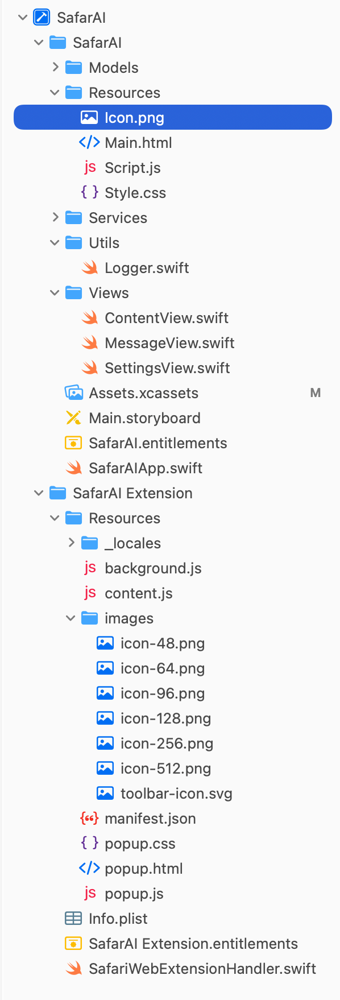
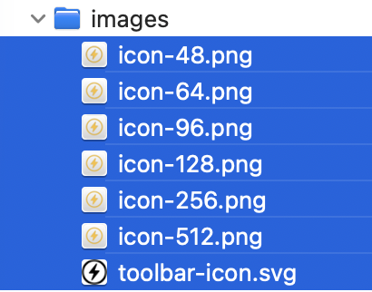

# Icon for Web View

I built a Safari Extension - that is contained in a macOS app. This safari extension also has an icon: it's called Icon.png and this is where it is located in the app code:



Note: There are versions of this icon under 

- SafarAI/SafarAI/SafarAI/Resources/Icon.png (384 × 384) 
- SafarAI/SafarAI/SafarAI Extension/Resources/images. Here we have multiple: 


This is what this icon looks like:


When calling generate-macos-icons these icons should also be generated, maybe in another directory.

---

## Decisions

1. **Icon sizes**: Generate all required sizes including 16, 19, 32, 38, 48, 64, 96, 128, and 384px
2. **Output location**: `logos/<Project>/generated/SafariExtension/`
3. **Naming convention**: Web standard `icon-{size}.png` (e.g., `icon-16.png`)
4. **Integration**: Always generate both macOS and Safari Extension icons (no flags needed)
5. **Documentation**: Generate manifest.json reference and HOWTO.md in SafariExtension directory

---

## Architecture

**Always Generate Both** - Single command generates both macOS app icons and Safari Extension icons.

**Rationale:**
- Simplest workflow for user (one command)
- No flags or options to remember
- Both icon sets always in sync with same source SVG

---

## Implementation Approach

### 1. Command-Line Interface

```bash
# Same command now generates both macOS and Safari Extension icons
./tools/generate-macos-icons --project SafarAI
```

### 2. Output Structure

```text
logos/SafarAI/generated/
├── 18_square_orbits.svg          # Source copy
├── macOS/                        # macOS app icons
│   ├── icon_16x16.png
│   ├── icon_16x16@2x.png
│   ├── ...
│   └── HOWTO.md
└── SafariExtension/              # Safari Extension icons
    ├── icon-16.png
    ├── icon-19.png
    ├── icon-32.png
    ├── icon-38.png
    ├── icon-48.png
    ├── icon-64.png
    ├── icon-96.png
    ├── icon-128.png
    ├── icon-384.png              # For Resources/Icon.png
    ├── manifest-reference.json   # Icon paths reference
    └── HOWTO.md
```

### 3. Extension Icon Sizes

All required sizes for Safari Extensions:
- 16, 19, 32, 38, 48, 64, 96, 128, 384

### 4. Implementation Changes

**Update `generate_macos_icons.py`:**

1. Add `generate_extension_icons()` function (similar to `generate_icons()`)
2. Call both functions in main workflow (no conditional logic needed)
3. Use web-standard naming: `icon-{size}.png` (no @2x variants)
4. Generate `manifest-reference.json` with icon paths
5. Create extension-specific HOWTO.md

**Key code structure:**

```python
def generate_extension_icons(svg_path, output_dir):
    """Generate Safari Extension icons."""
    sizes = [16, 19, 32, 38, 48, 64, 96, 128, 384]
    for size in sizes:
        filename = f"icon-{size}.png"
        generate_png(svg_path, output_dir / filename, size)
```

### 5. Configuration

Optional `tools/config.json` addition for customization:

```json
{
  "icon_sizes": [16, 32, 128, 256, 512],
  "generate_retina": true,
  "extension_sizes": [16, 19, 32, 38, 48, 64, 96, 128, 384]
}
```

---

## Notes

- Safari Extension icons use web naming convention: `icon-16.png`, `icon-32.png`, etc.
- No @2x retina variants needed for extension icons (unlike macOS AppIcon)
- These icons appear in Safari's toolbar, menu, and extension UI
- The 384px version is used for Resources/Icon.png in the app bundle